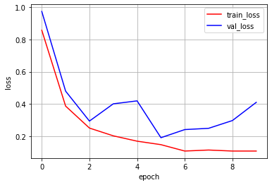
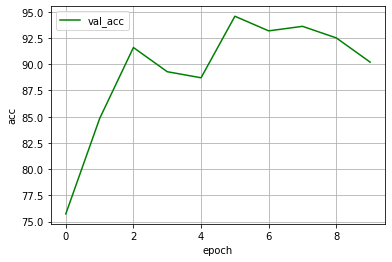
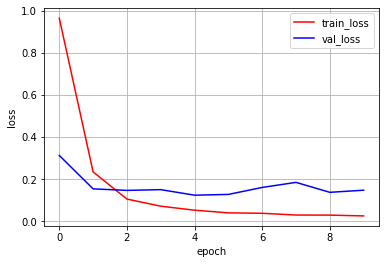
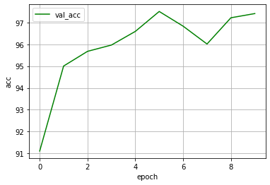
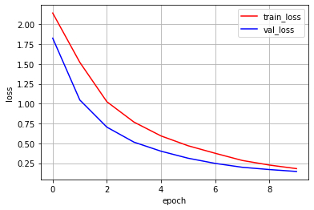
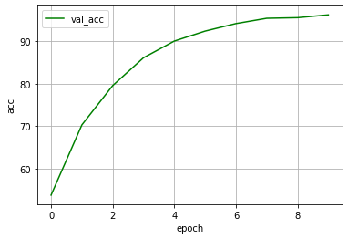
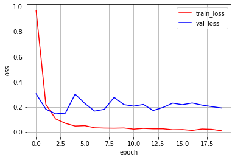
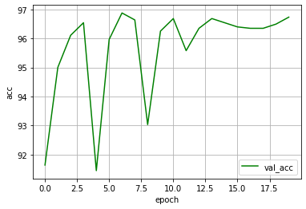
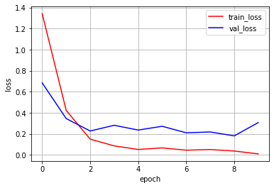
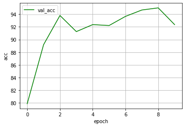

# paddy_doctor

参加：
https://www.kaggle.com/competitions/paddy-disease-classification/overview

稲の病気を画像から検出するというコンペティション

（概要書く）

（画像はる）

# 結果
## 一回目の提出（v12）
EfficientNet-b4を利用し，20エポックで行った．

正答率97.270％程度を達成し，5月27日時点で100チーム中25位という結果を得ました．

(画像はる)

## 二回目の提出（v15）
EfficientNet-b4を利用し，21エポックで行った．
損失関数を，AdamからAdamWに変更した．

正答率 95.040％程度で、チームベストを更新することができなかった．

（結果）

（学習曲線を貼る）

## 三回目の提出（v16）
DeiT-baseを利用し，20エポックで行った．

正答率95.847程度で，ベストを更新することができなかった．

### エポックごとの損失

### エポックごとのvalidation accuracy

## 四回目の提出(v17)
EfficientNet-b4を利用し，20エポックで行った．
損失関数を，Adam．テストの重みを、検証での最良値から最終エポックでの重みに変更。

正答率 97.231％程度で、チームベストを更新することができなかった．

(ベストの重みでは、正答率97.270%であった)

### エポックごとの損失

### エポックごとのvalidation accuracy

## 5回目の提出(v18)
Cait-S24を利用し，Adamを用い，20エポックで行った．

正答率93.348程度で，ベストを更新することができなかった．

## 6回目の提出(v19)
EfficientNet-b4、最適化関数AdamW(lr=0.001), 10epoch実行した。

ベストの重みを使用した正答率は94.463%であり、10エポック目の重みを使用した正答率は91.234%であった。

### エポックごとの損失

### エポックごとのvalidation accuracy

## 7回目の提出(v20)
EfficientNet-b4、最適化関数AdamW(lr=0.0001), 10epoch実行した。

ベストの重みを使用した正答率は97.424%であり、10エポック目の重みを使用した正答率は97.424%であった。

チームベストを更新した。

### エポックごとの損失

### エポックごとのvalidation accuracy

## 8回目の提出(v21)
EfficientNet-b4、最適化関数Adam(lr=0.00001), 10epoch実行した。

ベストの重みを使用した正答率は96.001%であり、10エポック目の重みを使用した正答率は96.001%であった。

### エポックごとの損失

### エポックごとのvalidation accuracy

## 9回目(v22)
EfficientNet-b4，最適化関数RAdam(lr=0.001)，15epoch実行した．

### エポックごとの損失

### エポックごとのvalidation accuracy

## 10回目の提出(v23)
EfficientNet-b4、最適化関数AdamW(lr=0.0001), 20epoch実行した。

ベストの重みを使用した正答率は97.270%であり、20エポック目の重みを使用した正答率は97.770%であった。

チームベストを更新。

### エポックごとの損失

### エポックごとのvalidation accuracy

## 11回目の提出(v24)
Cait-S24を利用し，AdamWを用い，20エポックで行った．

正答率95.655程度で，ベストを更新することができなかった．

### エポックごとの損失

### エポックごとのvalidation accuracy

## 13回目の提出(v26)
Cait-S24を利用し，RAdam(lr=1e-5)を用い，バッチサイズを32に変更して，10エポックで行った．

正答率92.810程度で，ベストを更新することができなかった．

### エポックごとの損失

### エポックごとのvalidation accuracy

## 14回目の提出(v27)
Swinを利用し，RAdam(lr=1e-4)を用い，バッチサイズ32で，10エポックで行った．

正答率97.116程度で，ベストを更新することができなかった．

### エポックごとの損失

### エポックごとのvalidation accuracy

## 15回目の提出(v28)
Coat_lite_smallを利用し，RAdam(lr=1e-4)を用い，バッチサイズ32で，10エポックで行った．

ベストの重みを使用した正答率は96.078%であり、10エポック目の重みを使用した正答率は91.964%であった。

チームベストを更新できなかった。

### エポックごとの損失

### エポックごとのvalidation accuracy

## 16回目の提出(v29)
Swinを利用し，RAdam(lr=1e-4)を用い，バッチサイズ32で，20エポックで行った．

正答率96.693程度で，ベストを更新することができなかった．

### エポックごとの損失

### エポックごとのvalidation accuracy

## 17回目の提出(v31)
efficientnetv2を利用し，RAdam(lr=1e-4)を用い，バッチサイズ32で，20エポックで行った．

正答率85.544程度で，ベストを更新することができなかった．
### エポックごとの損失

### エポックごとのvalidation accuracy

## 17回目の提出(v31)
efficientnetv2を利用し，RAdam(lr=1e-3)を用い，バッチサイズ32で，20エポックで行った．

正答率89.388程度で，ベストを更新することができなかった．
### エポックごとの損失

### エポックごとのvalidation accuracy

## 18回目の提出(v35)
Swinを利用し，RAdam(lr=1e-3)を用い，バッチサイズ32で，20エポックで行った．

正答率96.847程度で，ベストを更新することができなかった．

### エポックごとの損失

### エポックごとのvalidation accuracy

## 19回目の提出(v30_batch_16)
efficientnet-b4を利用し、RAdam(lr=0.0001)を用い、バッチサイズ16,20エポック行った。

正解率96.386程度で，ベストを更新することができなかった．

### エポックごとの損失

### エポックごとのvalidation accuracy

## 20回目の提出(v34)
efficientnet-b4を利用し、RAdam(lr=0.001)を用い、バッチサイズ16,20エポック行った。

正解率97.270程度で，ベストを更新することができなかった．

### エポックごとの損失

### エポックごとのvalidation accuracy

## 21回目の提出(v39)
efficientnet-b5を利用し、AdamW(lr=0.001)を用い、バッチサイズ8,20(実際は14エポック目で停止）エポック行った。

正解率 97.001程度で，ベストを更新することができなかった．

## 22回目の提出(v38)
Swinを利用し，RAdam(lr=1e-4)を用い，バッチサイズ32で，30エポックで行った．

正答率97.693程度で，ベストを更新することができなかった．

### エポックごとの損失

### エポックごとのvalidation accuracy

## 23回目の提出(v40)
Swinを利用し，RAdam(lr=1e-3)を用い，バッチサイズ32で，30エポックで行った．

正答率96.270程度で，ベストを更新することができなかった．

### エポックごとの損失

### エポックごとのvalidation accuracy

## 24回目の提出(v41)
Swinを利用し，AdamW(lr=1e-4)を用い，バッチサイズ32で，30エポックで行った．

正答率97.654程度で，ベストを更新することができなかった．

### エポックごとの損失

### エポックごとのvalidation accuracy

# スケジュール
- 5/14 チーム開発環境の構築
    - trainデータをtrainとvaridの２つに分ける関数作成
    - データの4種類の情報を読み取るように変更。テスト結果をcsvファイルに記録する関数作成
    - Kaggle Notebook　でmainプログラム動くように移植する

- 5/20 Kaggle Notebook でmain.pyを動かしてみる（エラーあっていい）
    - 皆：エラー修正を行う(テストデータ用ローダー(TestDataset.py)の作成＋def test()の修正)
    - エラー修正終わったら、改善のアイデア出し

- 5/27 mainプログラムでのエラーがゼロ。改善のアイデアだし。

- 6/3 アイデアを反映したプログラム作成

- 6/10 アイデアを反映したプログラム実装

- 6/17 spyral3

- 6/24(最終日) spyral 3

# 中間反省会
良かった点
- 取り掛かりが早く，連絡をこまめに行いながらのエラー対応を行った．
    - スムーズに進行できた．
    - 後半余裕できた．
- 要求仕様書を作成し，共有したことが円滑なコミュニケーションがうまくいった．
    - 各自の作業の組み合わせがうまくいった．
    - 分担・作業の明確化
- エラー修正など共有しながら行った．
    - 初学者からしたらMLの理解が深まって良かった
    - エラーの共有めっちゃ重要
        - ここ大きかった．

悪かった点
- リーダーの負担が大きかった．
    - リーダーの作業量を減らす．
- リーダーが対応できなかったときに問題を放置してしまった（3日ほど）．
    - サブリーダーを決めておく．

# データ
    train.csv
        image_id：各画像を識別するためのID．train_imagesディレクトリに.jpg形式で入っている．
        label：水稲の病気の種類．9種類の病気ラベル＋1種類の正常ラベル．
            bacterial_leaf_blight：葉枯病(苗がしおれ、葉が黄変・乾燥)
            bacterial_leaf_streak：細菌性葉巻病(葉の褐変と乾燥)
            bacterial_panicle_blight：穂の枯れ(稲全体が白っぽく変色)
            blast：稲熱(いもち)病(稲の葉、襟、節、首、穂軸の一部、時には葉鞘など、地上部のあらゆる部分を侵す)
            brown_spot：葉鞘褐変病？(多数の大きな斑点で、葉全体が枯れる)
            dead_heart：稲の枯れ？
            downy_mildew：うどんこ病(葉の表面に白いカビ)
            hispa：イネヒバ？(虫による病害，葉の上面を削り，下部の表皮を残す)
            normal：正常
            tungro：稲ツングロ病(ヨコバイという虫による病害，葉の変色・生育阻害・蘖（ひこばえ）数の減少・不稔粒や一部充填粒の発生などの症状)
        variety：水稲の品種名．
        age：栽培年数．
    sample_submission.csv
        提出ファイル例
    train_images
        10,407枚の訓練画像が各ラベルディレクトリに入っている．ファイルネームはimage_id.jpg
    test_images
        3,469枚のテスト画像が入っている．
# ルール
    - ソースコードを組む際に実装できない場合や，エラーが出た場合は，各自30分は考える．考えて分からなかった場合はすぐにラインで相談し共有するようにする．
    - Githubで管理する．
    - 週一の報告を設ける．（進捗確認）
    - 要求仕様書を作成し，それに従う．
    - 一人の負担が大きくならないように，チーム内で協力して取り組む．．

# 問題点
    
